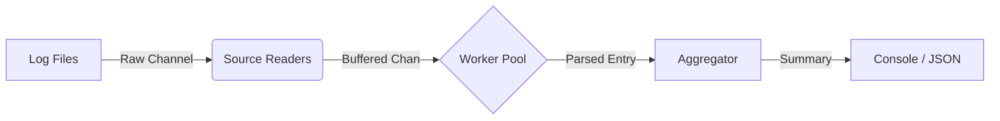

# ⚡ go-logstreamer

> A high-performance concurrent log processing pipeline built in Go.
## 🚀 Overview
**go-logstreamer** is a robust CLI tool designed to ingest massive log streams from multiple sources, process them concurrently using a worker-pool pattern, and aggregate insights in real-time.

It serves as a reference implementation for **production-grade Go concurrency**, featuring graceful shutdowns, backpressure handling, and performance profiling.

---

## Demo & Performance

Processed **50 Million log lines** in just **~51 seconds** on a standard machine!

| Metric | Result |
| :--- | :--- |
| **Throughput** | **~980,392 lines/sec** |
| **Total Time** | 51.92s (for 50M lines) |
| **Memory** | Optimized via Zero-Allocation Logging |

*(Replace this link with your actual screenshot)*

---

## 🧠 Key Features

- **Concurrent Ingestion:** Spawns dedicated goroutines for each file source.
- **Worker Pool Pattern:** Configurable workers to handle heavy parsing loads without blocking.
- **Graceful Shutdown:** Handles `SIGINT` / `SIGTERM` safely, ensuring no data loss using Context propagation.
- **Observability:**
  - Structured Logging via [zerolog](https://github.com/rs/zerolog).
  - CPU Profiling (`pprof`) enabled for bottleneck analysis.
- **Output Formats:** Console summary & JSON export for downstream analysis.

---

## 🏗️ Architecture

The pipeline follows a unidirectional data flow to prevent race conditions and deadlocks:

