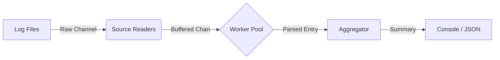

# ⚡ go-logstreamer

> A high-performance concurrent log processing pipeline built in Go.
## 🚀 Overview
**go-logstreamer** is a robust CLI tool designed to ingest massive log streams from multiple sources, process them concurrently using a worker-pool pattern, and aggregate insights in real-time.

It serves as a reference implementation for **production-grade Go concurrency**, featuring graceful shutdowns, backpressure handling, and performance profiling.

---

## Demo & Performance

Processed **50 Million log lines** in just **~51 seconds** on a standard machine!

| Metric         | Result                                |
| :------------- | :------------------------------------ |
| **Throughput** | **~980,392 lines/sec**                |
| **Total Time** | 51.92s (for 50M lines)                |
| **Memory**     | Optimized via Zero-Allocation Logging |


---

## 🧠 Key Features

- **Concurrent Ingestion:** Spawns dedicated goroutines for each file source.
- **Worker Pool Pattern:** Configurable workers to handle heavy parsing loads without blocking.
- **Graceful Shutdown:** Handles `SIGINT` / `SIGTERM` safely, ensuring no data loss using Context propagation.
- **Observability:**
  - Structured Logging via [zerolog](https://github.com/rs/zerolog).
  - CPU Profiling (`pprof`) enabled for bottleneck analysis.
- **Output Formats:** Console summary & JSON export for downstream analysis.

---

## 🏗️ Architecture

The pipeline follows a unidirectional data flow to prevent race conditions and deadlocks:


## ⚙️ Installation & Usage
1. Prerequisites
- Go 1.21 or higher

1. Run the Streamer

```bash
go run cmd/logstreamer/main.go --files=a.log,b.log --workers=8 --buffer=10000 --output=summary.json
```


Flags:
- files: Comma-separated list of log files path.
- workers: Number of concurrent parsing workers (Default: CPU Cores).
- buffer: Channel buffer size to handle backpressure.
- output: Path to save the JSON summary.

## Sample Data Format
```log
INFO 2024-01-20T10:00:00Z auth-service User logged in
ERROR 2024-01-20T10:00:05Z payment-service Payment failed
```

Profiling (Dev Tools)
To analyze CPU usage and bottlenecks:

1. Run the app (it auto-generates cpu.out).

2. Analyze using pprof:

```bash
go tool pprof cpu.out
```
```bash
top
list <function_name>
web

```